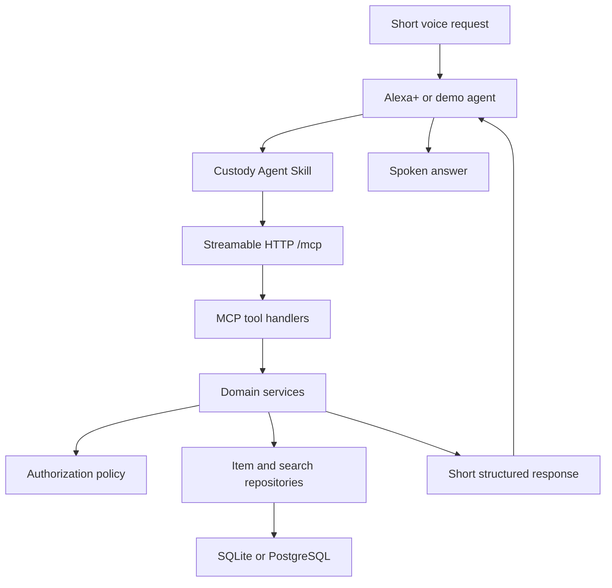

# Custody

> **Tell it once. Find it later. Know who has it.**

Custody is a voice-first shared object memory for Alexa+. It helps households remember where an item was last reported, identify who currently has a shared item, correct stale records naturally, and guide a user through a short search when the item is not where expected.

This repository is planned as both:

- a self-hosted Model Context Protocol server named `mcp-server-custody`, served over Streamable HTTP; and
- a portable Agent Skill that teaches a compatible agent how to use Custody's tools safely and respond in a concise, voice-native style.

Custody is being designed for the Alexa+ track of Amazon's **Build, Ship, Shape** developer hackathon.

## Development status

**Transport scaffold implemented.** The FastAPI host, Streamable HTTP MCP endpoint, health check, and six typed stub tools are in place. Database-backed behavior begins in Milestone 2.

## Naming

| Purpose | Name |
| --- | --- |
| Product | **Custody** |
| Recommended repository | `custody-alexa-mcp` |
| MCP server identity | `mcp-server-custody` |
| Python package | `custody_mcp` |
| Agent Skill name | `custody` |
| Public MCP endpoint | `GET/POST/DELETE /mcp` |
| Health endpoint | `GET /health` |

The repository name includes both Alexa and MCP so that “Custody” is not mistaken for a legal, child-custody, or evidence-management project.

## GitHub repository description

> Voice-first shared object memory for Alexa+: a Streamable HTTP MCP server and Agent Skill for locating items, correcting stale records, Lost Mode, shared custody, and privacy-aware access.

Suggested repository topics:

`alexa-plus` · `mcp` · `model-context-protocol` · `agent-skills` · `fastapi` · `python` · `voice-ai` · `accessibility` · `hackathon`

## The problem

Most object-location tools assume that a user can visually scan a room, open an app, or maintain a perfectly accurate inventory. That breaks down for:

- blind and low-vision users;
- people who benefit from reduced working-memory demands;
- older adults and caregivers;
- families sharing keys, tools, documents, remotes, and other objects; and
- workshops or small teams lending shared equipment.

The hard problem is not merely storing `item = location`. Real households produce incomplete, stale, and conflicting information. Custody therefore treats every location as a **reported event with provenance**, not as an unquestionable fact.

## Product promise

Custody should answer four practical questions:

1. Where was this item last reported?
2. Who reported or moved it, and when?
3. Who currently has it if it was borrowed?
4. What should I check next if the recorded location is stale?

It must never pretend to physically track an object that it cannot sense.

## Voice-native interaction

### Remember an item

**User:** “Remember that my keys are on the hallway console.”

**Custody:** “Got it. Your keys are on the hallway console.”

### Retrieve an item

**User:** “Where are my keys?”

**Custody:** “You last reported them on the hallway console this morning.”

### Correct a stale record

**User:** “They weren’t there. I found them in my work bag.”

**Custody:** “Got it. I’ll remember that your keys are now in your work bag.”

### Check out a shared item

**User:** “I’m taking the drill.”

**Custody:** “Okay. I’ve recorded that you have the drill.”

Later, another authorized household member asks:

**User:** “Where is the drill?”

**Custody:** “Michael checked out the drill at 2:30 this afternoon.”

### Start Lost Mode

**User:** “The keys aren’t there. Help me find them.”

**Custody:** “Let’s look together. First, check your work backpack. Say ‘next’ if they aren’t there.”

## Product principles

1. **Reported, not guaranteed.** Say “last reported” or “you last said,” never “definitely located.”
2. **Short speech.** Default spoken responses should contain no more than 25 words.
3. **One step at a time.** Lost Mode gives one search instruction, not a spoken list.
4. **Self-healing state.** Natural corrections append new events and update current state.
5. **Privacy before convenience.** Authorization is checked before existence or location is revealed.
6. **Deterministic truth.** The database owns item state. An LLM may interpret language but must not invent location facts.
7. **Auditable history.** Placement, movement, checkout, check-in, correction, and missing-item actions are stored as events.
8. **Explicit destructive confirmation.** Forgetting an item requires confirmation and permanently removes its associated records.

## MVP scope

The MVP contains five user capabilities delivered through six MCP tools.

| Capability | Outcome |
| --- | --- |
| Remember and locate | Save an item event and retrieve the latest authorized state |
| Natural correction | Update stale state using conversational corrections |
| Lost Mode | Search previous or configured locations one step at a time |
| Shared custody | Check items out and back in, with holder attribution |
| Privacy controls | Mark items private, shared, or restricted and delete them permanently |

## MCP tool surface

All tools are exposed through the single Streamable HTTP MCP endpoint at `/mcp`.

| Tool | Type | Purpose |
| --- | --- | --- |
| `record_item_event` | Write | Record placement, movement, correction, found, missing, checkout, or check-in events |
| `locate_item` | Read | Return the latest authorized location or custody state with provenance |
| `start_lost_mode` | Write/read | Create a guided search session and return the first step |
| `continue_lost_mode` | Write/read | Record a search result and return the next step or close the session |
| `set_item_access` | Write | Set private, household-shared, or restricted access |
| `forget_item` | Destructive write | Permanently remove an item and its associated history after confirmation |

### Shared tool response

Every tool returns structured data plus a short `speech` field intended for the voice response.

```json
{
  "status": "ok",
  "speech": "You last reported the keys in your work bag this morning.",
  "item_id": "item_01J...",
  "confirmation_required": false,
  "next_action": null,
  "data": {
    "location": "work bag",
    "reported_by": "Favour",
    "reported_at": "2026-09-06T08:15:00Z"
  }
}
```

The Agent Skill should normally speak only the `speech` value. Structured fields exist for the agent, simulator, tests, and optional visual presentation.

## Tool contracts

### `record_item_event`

Records an immutable event and atomically updates the item's current state.

Planned inputs:

| Field | Type | Required | Notes |
| --- | --- | --- | --- |
| `item_name` | string | Yes | Natural name used by the speaker |
| `event_type` | enum | Yes | `placed`, `moved`, `found`, `checked_out`, `checked_in`, or `marked_missing` |
| `actor_id` | string | Demo only | Derived from authentication in production |
| `location` | string/null | Conditional | Required for `placed`, `moved`, and `found` |
| `holder_id` | string/null | Conditional | Used for checkout; defaults to current actor |
| `occurred_at` | datetime/null | No | Server time is used when omitted |
| `operation_id` | string/null | No | Supports idempotency on retried writes |

Important behavior:

- Append history instead of overwriting the previous event.
- Normalize the item name and resolve authorized aliases.
- Do not expose private-item matches during entity resolution.
- Require a location for location-changing events.
- Clear custody on a valid check-in.
- Return a short confirmation suitable for speech.

### `locate_item`

Returns the most recent authorized state without claiming physical certainty.

Planned inputs:

| Field | Type | Required | Notes |
| --- | --- | --- | --- |
| `item_name` | string | Yes | May be a canonical name or known alias |
| `requester_id` | string | Demo only | Derived from authentication in production |

Priority rules:

1. Enforce access before returning or acknowledging the item.
2. If checked out, return the current holder and checkout time.
3. Otherwise, return the last reported location, reporter, and timestamp.
4. If marked missing, say so and offer Lost Mode.
5. If no authorized match exists, return the same neutral result used for a nonexistent item.

### `start_lost_mode`

Creates a search session and returns exactly one search step.

Planned inputs:

| Field | Type | Required |
| --- | --- | --- |
| `item_name` | string | Yes |
| `requester_id` | string | Demo only |

Candidate search locations are drawn from:

1. the item's most recent distinct location events;
2. user-confirmed search locations for that item; and
3. safe, deterministic category defaults when explicitly configured.

The service must not invent locations from unrelated household activity.

### `continue_lost_mode`

Advances or closes an active Lost Mode session.

Planned inputs:

| Field | Type | Required | Notes |
| --- | --- | --- | --- |
| `search_session_id` | string | Yes | Returned by `start_lost_mode` |
| `result` | enum | Yes | `found`, `not_found`, `skip`, or `cancel` |
| `requester_id` | string | Demo only | Must own or be authorized for the session |
| `found_location` | string/null | Conditional | Required when result is `found` unless the current step supplies it |

When the item is found, the service records a `found` event, updates current state, and closes the session.

### `set_item_access`

Changes who may discover and retrieve an item.

Planned inputs:

| Field | Type | Required | Notes |
| --- | --- | --- | --- |
| `item_name` | string | Yes | Owner-authorized item |
| `requester_id` | string | Demo only | Must be the owner or an authorized administrator |
| `visibility` | enum | Yes | `private`, `shared`, or `restricted` |
| `allowed_user_ids` | list[string]/null | Conditional | Used for `restricted` visibility |

Unauthorized requests receive a neutral not-found response so the server does not reveal that a private item exists.

### `forget_item`

Permanently removes the item, aliases, events, permissions, custody state, and Lost Mode sessions.

Planned inputs:

| Field | Type | Required | Notes |
| --- | --- | --- | --- |
| `item_name` | string | Yes | Item to remove |
| `requester_id` | string | Demo only | Must own the item |
| `confirmed` | boolean | Yes | Must be `true` after explicit user confirmation |

If `confirmed` is false, the tool returns `confirmation_required: true` without deleting anything.

## Architecture



### Responsibility boundaries

| Layer | Responsibility |
| --- | --- |
| Alexa+ or demo agent | Understand the user's utterance, select a tool, ask necessary follow-up questions, and speak the short result |
| Agent Skill | Define when to use Custody, tool-selection rules, privacy behavior, confirmations, and voice-output constraints |
| MCP transport | Provide standard tool discovery and invocation over Streamable HTTP |
| Tool handlers | Validate MCP-facing inputs and map service results into structured tool output |
| Domain services | Apply event, custody, Lost Mode, and authorization rules |
| Repository layer | Persist and query users, households, items, events, permissions, and search sessions |
| Database | Store current state and immutable event history transactionally |

## Technology stack

### Core server

| Technology | Role |
| --- | --- |
| Python 3.12 | Application runtime |
| `mcp[cli]` v2 | Official MCP Python SDK, tool registration, structured output, Inspector integration, and Streamable HTTP |
| FastAPI | Host application, health endpoint, middleware, and future OAuth routes |
| Uvicorn | Local and deployed ASGI server |
| Pydantic v2 | Tool input/output schemas and application settings |

### Data layer

| Technology | Role |
| --- | --- |
| SQLAlchemy 2.0 async | ORM and transactional repository implementation |
| Alembic | Database migrations |
| SQLite + `aiosqlite` | Zero-configuration local development and unit tests |
| PostgreSQL + `asyncpg` | Recommended deployed database |
| RapidFuzz | Deterministic alias and approximate-name matching |

Alexa+ already provides the agentic language layer. The MCP server should keep truth resolution deterministic. Gemini or another LLM may later be used in the standalone demo client, but it is not required for the core Custody server.

### Quality and operations

| Technology | Role |
| --- | --- |
| Pytest and pytest-asyncio | Unit, integration, authorization, and tool-contract tests |
| HTTPX | HTTP and ASGI integration tests |
| Ruff | Linting and formatting |
| mypy | Static type checking |
| Docker | Reproducible deployment image |
| GitHub Codespaces/devcontainer | Consistent development environment |
| GitHub Actions | Automated lint, type, test, and build checks |
| Standard JSON logging | Request correlation and safe operational diagnostics |

### Authentication plan

- **Hackathon simulator:** explicit demo household and actor profiles supplied by the simulator.
- **Deployed Alexa+ integration:** OAuth 2.1 account linking and server-derived user identity.
- Tool arguments such as `actor_id` and `requester_id` are temporary simulator inputs. A production agent must not invent identity values.
- Per-speaker Alexa household identity is not assumed until the platform provides and documents it for the integration.

## Planned repository structure

```text
custody-alexa-mcp/
├── .agents/
│   └── skills/
│       └── custody/
│           ├── SKILL.md
│           ├── references/
│           │   └── tool-contracts.md
│           └── evals/
│               └── evals.json
├── .devcontainer/
│   └── devcontainer.json
├── .github/
│   └── workflows/
│       └── ci.yml
├── migrations/
├── src/
│   └── custody_mcp/
│       ├── __init__.py
│       ├── app.py
│       ├── config.py
│       ├── database.py
│       ├── mcp_server.py
│       ├── domain/
│       │   ├── enums.py
│       │   ├── models.py
│       │   └── policies.py
│       ├── repositories/
│       │   ├── items.py
│       │   ├── events.py
│       │   └── searches.py
│       ├── services/
│       │   ├── custody.py
│       │   └── lost_mode.py
│       └── tools/
│           ├── access.py
│           ├── items.py
│           └── lost_mode.py
├── tests/
│   ├── contract/
│   ├── integration/
│   └── unit/
├── .env.example
├── .gitignore
├── Dockerfile
├── LICENSE
├── pyproject.toml
└── README.md
```

## FastAPI and Streamable HTTP server template

The implementation will use the current v2 MCP Python SDK. In v2, the server class is `MCPServer`. The MCP application is mounted inside FastAPI, and the FastAPI lifespan explicitly starts the MCP session manager.

The following illustrates the intended server shape. Service methods are placeholders until their repository-backed implementations are added.

```python
from collections.abc import AsyncIterator
from contextlib import asynccontextmanager
from datetime import datetime
from typing import Any, Literal

from fastapi import FastAPI
from mcp.server import MCPServer
from pydantic import BaseModel, Field


EventType = Literal[
    "placed",
    "moved",
    "found",
    "checked_out",
    "checked_in",
    "marked_missing",
]
Visibility = Literal["private", "shared", "restricted"]
SearchResult = Literal["found", "not_found", "skip", "cancel"]


class CustodyToolResponse(BaseModel):
    status: Literal[
        "ok",
        "not_found",
        "confirmation_required",
        "forbidden",
        "completed",
    ]
    speech: str = Field(description="Voice-ready response of no more than 25 words")
    item_id: str | None = None
    confirmation_required: bool = False
    next_action: str | None = None
    data: dict[str, Any] = Field(default_factory=dict)


mcp = MCPServer(
    "mcp-server-custody",
    instructions=(
        "Use Custody to remember and locate physical items, track shared-item "
        "custody, correct stale locations, and guide Lost Mode. Treat every "
        "location as last reported rather than physically verified."
    ),
)


@mcp.tool(title="Record an item event")
async def record_item_event(
    item_name: str,
    event_type: EventType,
    actor_id: str,
    location: str | None = None,
    holder_id: str | None = None,
    occurred_at: datetime | None = None,
    operation_id: str | None = None,
) -> CustodyToolResponse:
    """Record that an item was placed, moved, found, borrowed, returned, or marked missing."""
    return await custody_service.record_item_event(
        item_name=item_name,
        event_type=event_type,
        actor_id=actor_id,
        location=location,
        holder_id=holder_id,
        occurred_at=occurred_at,
        operation_id=operation_id,
    )


@mcp.tool(title="Locate an item")
async def locate_item(
    item_name: str,
    requester_id: str,
) -> CustodyToolResponse:
    """Return an authorized item's last reported location or current holder."""
    return await custody_service.locate_item(
        item_name=item_name,
        requester_id=requester_id,
    )


@mcp.tool(title="Start Lost Mode")
async def start_lost_mode(
    item_name: str,
    requester_id: str,
) -> CustodyToolResponse:
    """Start a guided search and return only the first place to check."""
    return await lost_mode_service.start(
        item_name=item_name,
        requester_id=requester_id,
    )


@mcp.tool(title="Continue Lost Mode")
async def continue_lost_mode(
    search_session_id: str,
    result: SearchResult,
    requester_id: str,
    found_location: str | None = None,
) -> CustodyToolResponse:
    """Record the previous search result and return the next step or finish the search."""
    return await lost_mode_service.continue_search(
        search_session_id=search_session_id,
        result=result,
        requester_id=requester_id,
        found_location=found_location,
    )


@mcp.tool(title="Set item access")
async def set_item_access(
    item_name: str,
    requester_id: str,
    visibility: Visibility,
    allowed_user_ids: list[str] | None = None,
) -> CustodyToolResponse:
    """Set an owned item as private, household-shared, or restricted."""
    return await custody_service.set_item_access(
        item_name=item_name,
        requester_id=requester_id,
        visibility=visibility,
        allowed_user_ids=allowed_user_ids,
    )


@mcp.tool(title="Forget an item")
async def forget_item(
    item_name: str,
    requester_id: str,
    confirmed: bool = False,
) -> CustodyToolResponse:
    """Permanently delete an owned item and its records after explicit confirmation."""
    return await custody_service.forget_item(
        item_name=item_name,
        requester_id=requester_id,
        confirmed=confirmed,
    )


mcp_http_app = mcp.streamable_http_app()


@asynccontextmanager
async def lifespan(app: FastAPI) -> AsyncIterator[None]:
    async with mcp.session_manager.run():
        yield


app = FastAPI(
    title="Custody MCP Server",
    version="0.1.0",
    lifespan=lifespan,
)


@app.get("/health", tags=["operations"])
async def health() -> dict[str, str]:
    return {"status": "ok", "service": "mcp-server-custody"}


# Keep this mount after ordinary FastAPI routes because Mount("/") matches all paths.
app.mount("/", mcp_http_app)
```

When running locally, the MCP client connects to:

```text
http://127.0.0.1:8000/mcp
```

For a public hostname, the implementation must configure MCP transport security with an explicit Host and Origin allowlist. It must not disable DNS-rebinding protection merely to make deployment errors disappear.

## Data model

Custody uses current-state columns for fast answers plus append-only events for auditability.

### `households`

| Column | Purpose |
| --- | --- |
| `id` | Household boundary |
| `name` | Display name |
| `created_at` | Creation timestamp |

### `users`

| Column | Purpose |
| --- | --- |
| `id` | Internal user identity |
| `household_id` | Tenant boundary |
| `display_name` | Safe spoken attribution |
| `role` | Member or administrator |

### `items`

| Column | Purpose |
| --- | --- |
| `id` | Stable item identifier |
| `household_id` | Tenant boundary |
| `canonical_name` | Normalized item name |
| `owner_id` | Owner and privacy authority |
| `visibility` | Private, shared, or restricted |
| `status` | In place, checked out, or missing |
| `current_location` | Latest reported location |
| `current_holder_id` | Current borrower when checked out |
| `last_event_at` | Latest state-change timestamp |

### `item_aliases`

Maps phrases such as “car fob,” “Honda clicker,” and “spare car key” to an authorized canonical item.

### `item_events`

Immutable event history containing event type, actor, location, holder, timestamp, and optional idempotency operation ID.

### `item_permissions`

Stores explicit user access for restricted items.

### `search_sessions`

Stores Lost Mode state, ordered candidate locations, current index, requester, status, and completion outcome.

## Item resolution

Item matching proceeds in a privacy-safe order:

1. Limit candidates to the requester's household.
2. Remove items the requester is not authorized to discover.
3. Try an exact canonical-name match.
4. Try an exact alias match.
5. Apply conservative RapidFuzz matching above a configured threshold.
6. If multiple close matches remain, return a short clarification request.

The server must never run fuzzy matching over inaccessible items and then reveal the candidate names in an error.

## Authorization and privacy

### Visibility modes

| Mode | Access |
| --- | --- |
| `private` | Owner only |
| `shared` | Authorized household members |
| `restricted` | Owner plus explicitly selected members |

### Privacy rules

- Authorization precedes item lookup output, history output, and alias disclosure.
- Unauthorized and nonexistent items produce the same external response.
- Logs contain opaque IDs, not sensitive item names or locations.
- The server does not ingest ambient conversations.
- The server does not infer locations from unrelated smart-home telemetry in the MVP.
- `forget_item` performs a verified hard deletion of associated records.
- Destructive and access-changing actions require clear confirmation.

## Voice response contract

The Agent Skill and tests enforce the following:

- Prefer 8–20 spoken words; never exceed 25 words by default.
- Give one answer or one next step.
- Use ordinary words instead of IDs, timestamps, or status enums.
- Convert timestamps to human language such as “this morning” or “two hours ago.”
- Say “last reported” when state has not been physically verified.
- Never read a history list aloud.
- Ask only one clarification question at a time.
- Do not reveal internal errors, database names, tokens, or authorization logic.

## Agent Skill package

The canonical skill will live at:

```text
.agents/skills/custody/SKILL.md
```

Its YAML frontmatter will use `name: custody`, matching the parent directory. The skill will describe:

- when requests should activate Custody;
- how to choose among the six tools;
- how to interpret follow-up corrections;
- how to maintain Lost Mode conversation state;
- when confirmation is required;
- how to handle private or unknown items; and
- the maximum spoken-response length.

Detailed contracts will remain in `references/tool-contracts.md` so the core `SKILL.md` remains concise. Trigger and response evaluations will live in `evals/evals.json`.

## Local development plan

The final scaffold will use `uv` for dependency and command management.

### Prerequisites

- Python 3.12
- Git
- `uv`
- Node.js and `npx` for MCP Inspector
- Docker only when testing PostgreSQL or the production image

### Planned setup commands

```bash
git clone https://github.com/YOUR_USERNAME/custody-alexa-mcp.git
cd custody-alexa-mcp
uv sync --all-groups
cp .env.example .env
uv run alembic upgrade head
uv run uvicorn custody_mcp.app:app --reload
```

### Planned environment variables

```dotenv
APP_ENV=development
DATABASE_URL=sqlite+aiosqlite:///./custody.db
LOG_LEVEL=INFO
MCP_ALLOWED_HOSTS=127.0.0.1:*,localhost:*
MCP_ALLOWED_ORIGINS=http://127.0.0.1:*,http://localhost:*
FUZZY_MATCH_THRESHOLD=90
VOICE_MAX_WORDS=25
DEMO_AUTH_ENABLED=true
```

Secrets and real tokens must never be committed. `.env.example` contains names and safe defaults only.

## Running and inspecting the MCP server

After the implementation is scaffolded:

```bash
uv run uvicorn custody_mcp.app:app --host 127.0.0.1 --port 8000 --reload
```

Health check:

```bash
curl --fail http://127.0.0.1:8000/health
```

Expected response:

```json
{"status":"ok","service":"mcp-server-custody"}
```

The MCP endpoint itself is not a normal REST endpoint and should be exercised with an MCP client or Inspector rather than an arbitrary JSON body.

Planned Inspector command:

```bash
uv run mcp dev src/custody_mcp/mcp_server.py
```

The exact Inspector command will be finalized after the application factory and import path are implemented.

## Testing strategy

### Unit tests

- Item-name normalization and alias matching
- Event-driven state transitions
- Checkout and check-in rules
- Visibility and permission policies
- Lost Mode candidate ordering
- Voice-response word limit
- Idempotent duplicate write handling

### Integration tests

- Save then locate an item
- Correct a stale location and retrieve the correction
- Check out an item and retrieve its current holder
- Check an item back in and restore its location state
- Start and advance Lost Mode
- Finish Lost Mode with a found-location event
- Deny unauthorized discovery without revealing existence
- Require confirmation before deletion
- Permanently delete an item and its related records
- List and invoke all six tools through an in-process MCP client
- Connect through the deployed Streamable HTTP `/mcp` endpoint

### Agent Skill evaluations

Examples that should activate Custody:

- “Where did I put my keys?”
- “Remember that the passport is in the blue drawer.”
- “The drill isn't there. Help me look for it.”
- “Tell Custody that I’m borrowing the stud finder.”
- “Make my journal private.”

Examples that should not activate Custody:

- “Where is Mount Everest?”
- “Track my delivery.”
- “Find a hardware store near me.”
- “Remind me to call Sarah tomorrow.”
- “Where should I store a passport safely?”

## Continuous integration

Every pull request should run:

```bash
uv run ruff format --check .
uv run ruff check .
uv run mypy src
uv run pytest
```

The CI workflow should also build the Docker image after tests pass.

## Deployment approach

The service will be packaged as one Dockerized ASGI application with HTTPS termination at the hosting platform.

For the hackathon deployment:

- run one server process initially to avoid legacy-session routing complexity;
- use a managed PostgreSQL database;
- expose `/mcp` and `/health` only;
- configure exact MCP Host and Origin allowlists;
- terminate TLS at a trusted proxy or managed platform;
- trust forwarded headers only from that proxy;
- keep operational logs free of item names and locations; and
- verify protocol negotiation and every tool using MCP Inspector before connecting the simulator.

The final hosting provider will be selected after the local MCP and Alexa+ simulation pass end-to-end testing.

## Delivery plan

### Milestone 0 — Repository and Codespace

- [x] Create `custody-alexa-mcp`
- [x] Add MIT license
- [x] Open a GitHub Codespace
- [x] Add Python 3.12 devcontainer
- [x] Add `pyproject.toml`, Ruff, mypy, Pytest, and CI

**Exit condition:** A clean Codespace runs the test command successfully.

### Milestone 1 — MCP transport skeleton

- [x] Create `MCPServer("mcp-server-custody")`
- [x] Mount Streamable HTTP in FastAPI
- [x] Add `/health`
- [x] Register six stub tools with final schemas
- [ ] Verify tool discovery in MCP Inspector

**Exit condition:** Inspector lists exactly six tools and can invoke each stub.

### Milestone 2 — Database and event model

- [ ] Add SQLAlchemy models and Alembic migration
- [ ] Implement household, user, item, alias, event, permission, and search repositories
- [ ] Add transactional current-state updates
- [ ] Add demo household seed data

**Exit condition:** Database integration tests pass from an empty database.

### Milestone 3 — Core memory and custody

- [ ] Implement `record_item_event`
- [ ] Implement `locate_item`
- [ ] Implement checkout/check-in state
- [ ] Add provenance and voice-ready responses
- [ ] Add conservative alias resolution

**Exit condition:** Remember, locate, correct, checkout, and check-in flows pass end to end.

### Milestone 4 — Lost Mode and privacy

- [ ] Implement `start_lost_mode`
- [ ] Implement `continue_lost_mode`
- [ ] Implement `set_item_access`
- [ ] Implement confirmed `forget_item`
- [ ] Add privacy non-disclosure tests

**Exit condition:** Guided search, permission, and deletion scenarios pass without information leakage.

### Milestone 5 — Agent Skill and voice simulation

- [ ] Write `SKILL.md`
- [ ] Add tool-selection reference
- [ ] Add positive and negative trigger evaluations
- [ ] Connect to the Alexa+ Web Simulator when available
- [ ] Build a minimal fallback voice simulator if necessary

**Exit condition:** Natural utterances consistently select the correct tool and spoken answers remain within the voice limit.

### Milestone 6 — Deployment and hardening

- [ ] Add production Dockerfile
- [ ] Deploy with HTTPS and managed PostgreSQL
- [ ] Configure Host/Origin allowlists
- [ ] Add request correlation and sanitized logs
- [ ] Run remote MCP Inspector tests
- [ ] Export successful test traces

**Exit condition:** A fresh external client can discover and invoke all six tools over the public `/mcp` endpoint.

### Milestone 7 — Hackathon submission

- [ ] Record a demo under three minutes
- [ ] Complete architecture and setup documentation
- [ ] Add product feedback and friction log
- [ ] Confirm repository visibility, license, and reproducible setup
- [ ] Submit before the hackathon deadline

## Three-minute demo outline

| Time | Beat | Demonstrated value |
| --- | --- | --- |
| 0:00–0:20 | Accessibility problem and product promise | Why voice is necessary |
| 0:20–0:50 | Remember and locate keys | Fast voice-native happy path |
| 0:50–1:25 | Stale answer, Lost Mode, natural correction | Trust recovery and self-healing state |
| 1:25–1:55 | Borrow and locate a drill from another profile | Shared custody and attribution |
| 1:55–2:20 | Private-item request from unauthorized profile | Privacy-aware multi-user design |
| 2:20–2:45 | Inspector/tool trace and architecture | Genuine MCP implementation |
| 2:45–3:00 | Impact and future direction | Memorable closing |

## Non-goals for the MVP

Custody will not initially:

- listen to ambient household conversations;
- physically track objects through Bluetooth, RFID, cameras, or GPS;
- infer locations from smart locks or unrelated device telemetry;
- calculate invented confidence percentages;
- build object-to-object spatial graphs;
- interrupt users with proactive routine prompts;
- provide long spoken histories or on-screen inventory management; or
- claim that a last-reported location is physically verified.

These constraints keep the demo trustworthy, voice-native, privacy-conscious, and achievable.

## Key risks and mitigations

| Risk | Mitigation |
| --- | --- |
| Users forget to record movements | Natural correction loop and check-out phrasing |
| Stale records damage trust | Always include provenance and relative time; offer Lost Mode |
| Private item existence leaks | Authorization-first lookup and neutral not-found responses |
| Similar item names collide | Conservative matching and one short clarification question |
| Duplicate tool retries create events | Optional operation ID and database uniqueness constraint |
| Agent gives long answers | Dedicated `speech` field plus automated word-limit tests |
| Demo depends on undocumented speaker recognition | Explicit simulated profiles; production identity remains an account-linking concern |
| Deployment rejects remote MCP requests | Explicit Host/Origin allowlists and remote Inspector tests |

## Future possibilities

Only after the MVP is stable:

- optional QR, NFC, Bluetooth, or RFID evidence;
- caregiver-managed accessibility profiles;
- multilingual voice responses;
- organization/workshop mode with due-back times;
- optional visual history for screen-enabled devices; and
- privacy-preserving aggregate insights such as frequently misplaced item categories.

## Contributing

The project will accept focused issues and pull requests that preserve its voice-first and privacy-first principles. Proposed features should explain:

1. the specific user problem;
2. why voice is the correct interaction;
3. the required tool or schema change;
4. privacy and failure behavior; and
5. how the feature can be tested deterministically.

## License

MIT License. A complete `LICENSE` file will be added when the repository is initialized.

## References

- [Amazon Build, Ship, Shape Hackathon](https://amazonappdev2026.devpost.com/)
- [MCP Streamable HTTP specification](https://modelcontextprotocol.io/specification/2025-11-25/basic/transports)
- [Official MCP Python SDK](https://py.sdk.modelcontextprotocol.io/)
- [Mounting an MCP server in an ASGI application](https://py.sdk.modelcontextprotocol.io/run/asgi/)
- [Agent Skills specification](https://agentskills.io/specification)
